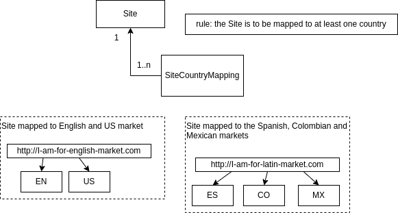

<h1>Legacy final aaa2</h1>

Find code smells



Example of usage:
```
POST /site/save
{
    "url": "http://product-site.com",
    "mappings": [ "US",   "FR"]
}
```

```
GET /site/get?id=17ea426c-1ea3-4bd4-bcec-392c1ed4f0f9
```

# TODO
The Site cannot be mapped to the same country multiple times.

